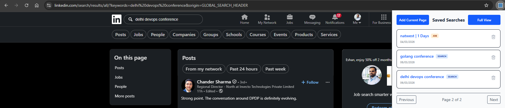
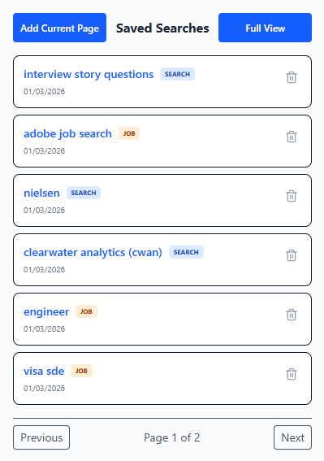
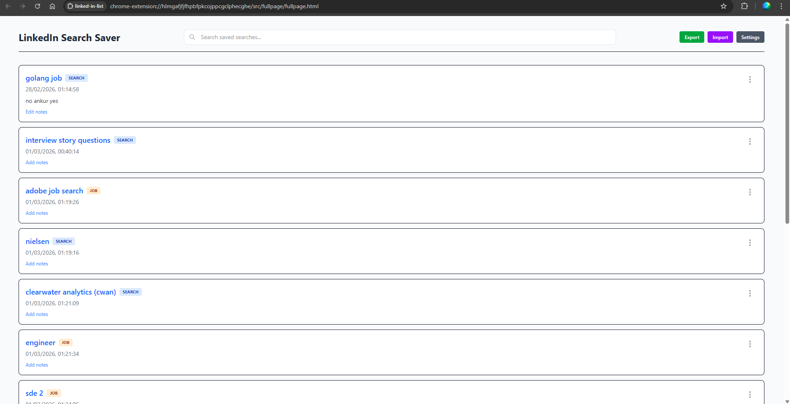
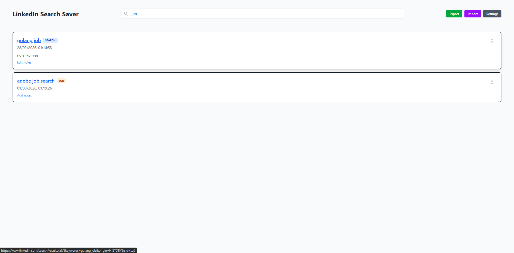
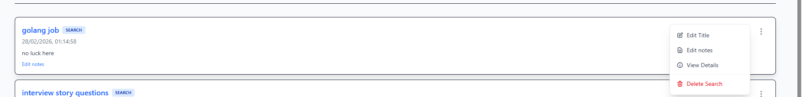
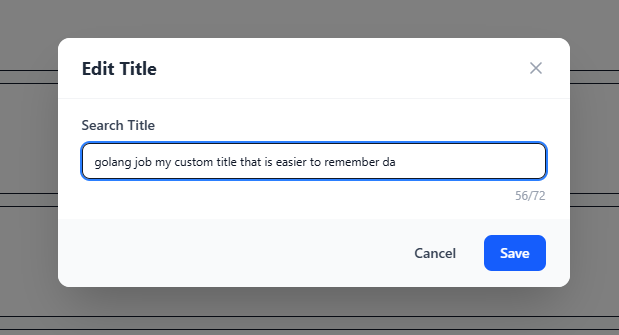
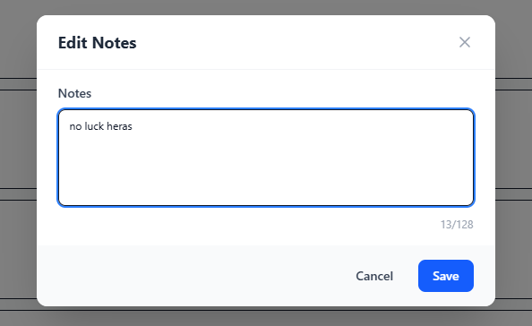

**LinkedIn Search Saver**

A lightweight **bookmark manager for LinkedIn saved searches**.
Save the search you’re currently viewing into an ordered list you can revisit later and customise to your liking.

Currently not on chrome extension web store, please use load unpacked extension (see instructions in [Installation](#install-unpacked)). I don't see any point of publishing to the web store but if there is some genuine merit then put it in Issues, I would think about it 🗿

## Showcase

### Popup View

|  |  |
| :--------------------------------: | :--------------------------------: |
|            Quick Access            |          Action Shortcuts          |

### Full Page Manager

|  |  |
| :---------------------------------------: | :---------------------------------------: |
|              Dashboard View               |           Management Interface            |

### Edit & Details

|  |  |  |
| :------------------------------------: | :------------------------------------: | :------------------------------------: |
|               Edit Title               |               Add Notes                |             View Metadata              |

## Features

- **One-keystroke save**: save the currently open LinkedIn search into the extension by the shortcut Alt+Shift+D
- **Quick add on the page**: or you can save the currently open LinkedIn search by clicking on the plus button at the bottom of supported pages
- **Direct addition**: manually add current search entry directly from the extension popup window.
- **Toolbar badge indicator**: on LinkedIn search pages the extension icon shows:
  - `+` when the search isn’t saved yet
  - `✓` when it’s already saved
- **Job search capability**: seamlessly save and manage both regular LinkedIn searches and LinkedIn job searches.
- **Search type labels**: visual tags on your saved items clearly indicate whether they are a general "Search" or a "Job Search".
- **Full View manager**:
  - drag-and-drop reorder
  - add/edit notes
  - inspect metadata (URL/id/timestamp)
  - remove entries
- **Export / Import**: backup and restore your saved searches as JSON.
- **Settings**:
  - title format: `compact` vs `verbose`
  - optional “native bookmark” integration toggle (disable if you don’t want saves triggered from browser bookmarks)

## Keyboard shortcut

- **Save current LinkedIn search**: `Alt+Shift+D` (Windows/Linux), `Option+Shift+D` (macOS)
- **Change the shortcut**: open Chrome’s shortcuts page at `chrome://extensions/shortcuts` and edit the command named **“Save currently open linked search”**.

## What counts as a “search”?

The extension supports both general LinkedIn searches (URLs under `linkedin.com/search/`) and LinkedIn job searches (URLs under `linkedin.com/jobs/search/`).

Saved entries include:

- **url**: the full search or job search URL
- **title**: generated from URL filters (keywords, location, time posted, remote, etc.); title rewriting support is being expanded over time
- **type**: indicates whether the saved entry is a regular "Search" or a "Job Search", displayed as a visual badge
- **notes**: optional free text you add later
- **timestamp** and **order**: used for display and sorting

## Install (unpacked)

This project builds a **Manifest V3** Chrome extension.

### Build from source

```bash
npm install
npm run build
```

Then in Chrome:

- Go to **Manage extensions** (`chrome://extensions/`)
- Enable **Developer mode**
- Click **Load unpacked**
- Select the generated `dist` folder

`npm run build` also produces a zipped artifact in `release/` (useful for sharing the build output).

### Development

```bash
npm run dev
```

Load the `dist` folder as an unpacked extension (same as above). When you change code, rebuild/reload the extension as needed.

## Data & privacy

- Saved searches and settings are stored locally using `chrome.storage.local`.
- No server component; nothing is uploaded by this project.

## Stuff that can be added but I digress

- Chrome extension store publishing - would need to give 5 dollars
- Improved vocabulary of job titles - currently there are only generic ones for SDE, SWE etc
- Improved coverage of filters - not all linked filters are covered currently but covering them all would take too much time. For example somehow getting companyId list and then use it on `f_C` query param

## Stuff that can be added but I would need to cover server costs

- Optional cross device sync per google account
- AI based improvement on search terms (feed search URLs and get a good search term)

## License

MIT
